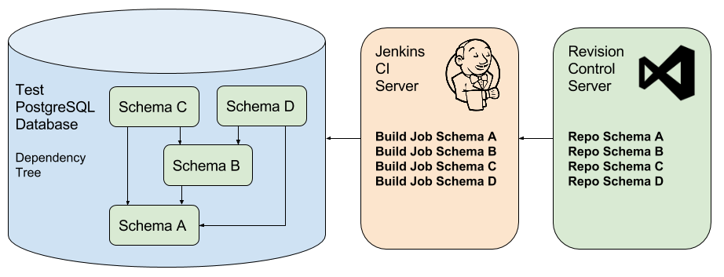
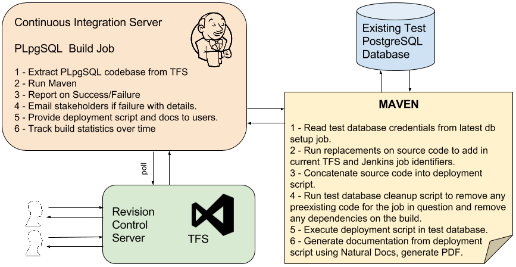

# Tentative_PLpgSQL_CI

Integrating Continuous Integration practices into database application development can be difficult for a variety of reasons.  More traditional software development is largely about code and making sure that logic components works well together.  Adding in database schema management and the data itself can greatly complicate things as portions or all of the "data" side of things may be maintained by other parties in more of a traditional static database-is-what-database-is manner.  In this situation it can be clunky to try and implement a true CI "create the database from scratch" for each build.  In additional the size of the data in question needs to be taken into account.  Processing 10s of gigs of geospatial data for each build can mean individual builds that last an entire night or even days.  

This "tentative" PLpgSQL repository is meant to document one stab at a logic-only approach to PLpgSQL via CI.  Basically I simply pass on the idea of data and schema management.  Feel free to look down on me for that, I deserve it.  In my case I have a very complex ecosystem of data whereby data and schema are developed much further upstream from the PostgreSQL instance in question and run through a series of heterogenous ETL conversions.  

So again my approach is to simply implement CI on the logic side as a good start.  So from the point of view of my CI system, the data-only PostgreSQL pg_dump file is the input.  The data and schema flow down to me and I simply consume it into my CI system.  Hopefully communication is in place to notify me of schema or data changes that affect my logic that come down the above pipeline.

####Jenkins Database Setup Job
See the example [pom.xml] (db_pom.xml) for a working example.

So then a single manual Jenkins job is created to build a test database that then other CI processes can utilize.

In this example I store the [database setup script](SupportFiles/database_setup.sql) under version control like any other script.  This script contains alterations to the base PostgreSQL database provisioning.  In my case this is mainly related to setting up PostGIS as needed by the code logic.  

Next I create a test database.  For my initial go at this I chose to use the [Jenkins Job Database Manager plugin](http://jbox-web.github.io/job-database-manager-postgresql/).  At first blush it seemed like everything I wanted but in the end turned out to be not so useful.  Probably this should be moved into the maven processing as a custom shell script.  But for now its functional.

Then we run Maven which executes the setup script and then load the PostgreSQL data dump.  For my particular situation this load requires about 8 hours to complete.  So this is not something you'd do several times a day for a minor change.  I suppose in a period of high change you could run it overnight but my thought for now at least would be the job build is on-demand.

####Jenkins PLpgSQL Job
See the example pom.xml (logic_pom.xml) for a working example.

At this point setting up proper CI may often hinge on your overarching architecture and managing logic dependencies.  If you've done database development for long you surely have encountered spaghetti-like webs of interconnected, circular and often unmanaged dependencies.  Running a build may require an initial effort of detanglement that in fact could be your first task in approaching CI.  A certain level of isolation, packaging and clear (to the team) code dependence is needed to assure that builds pop off in the correct order and report correctly on their success or failure.

In my example, I have fairly simple four schema structure that represents code behind three web services, two of which (C and D) rely on functionality expressed in the third (B).  All three draw data and logic from the base schema (A).  

Now perhaps when any one of the four components receives a commit, then all four should be rebuilt.  I mean yes that is true CI.  But in my example, item B takes about an hour to fully build as there is data processing component.  Thus I would like if only item D is being worked upon, to just build and rebuild D as needed leaving items B and A alone.  I agree this is being rather mealy-mouthed about CI but then I did label this as "tentative".  So when item A is built, part of the cleanup script is to destroy B, C and D in the test database.  When B is built, similarly C and D are destroyed.  And C and D only refresh themselves.  In this manner we can roughly control the needed dependencies.  If A is refreshed and an attempt is made to immediately rebuild D, the process will fail as B will be missing.  One way to enforce some disciple is to set up a [throttling group](https://wiki.jenkins-ci.org/display/JENKINS/Throttle+Concurrent+Builds+Plugin) to only allow one of the builds to be running at any given time thus disallowing builds from overrunning each other.  I remain undecided on whether build decisions can be fully automated.  Perhaps it depends on the volume and kind of workflow.  During certain times automated builds are appropriate but during other more tricky times of integration, they should be manually controlled.  

So then each of my PLpgSQL job relates to a single schema.  This convention is not required but does help with packaging and isolation and tracking/enforcing dependencies.  Team members should understand what a given schema uses and who uses resources in that schema.  Broken builds will tell your team if they have it wrong.

The above job thus has by definition an existing test database available for use.  Jenkins will provide to the build the credentials files create in the database setup job.  If the database setup job is rerun, the PLpgSQL job just picks up the new set of credentials.  Before anything further the test database is cleaned of preexisting code and any other code dependent on the build.

With the test database ready the Maven script concatenates together the source code to create a single deployment script.  This script is then executed on the test database. And finally the deployment script is processed through NaturalDocs to convert inline documentation into an HTML doc output.  This in turn is then converted to a PDF file which is provided to Jenkins to store and serve out as a build document.

###Conclusions
The above solution may appear rather cobbled together but basically works okay for me.  It may or may not suite your coding and/or workflow.  I would appreciate it if you drop me a line with any thoughts or suggestions you have.

